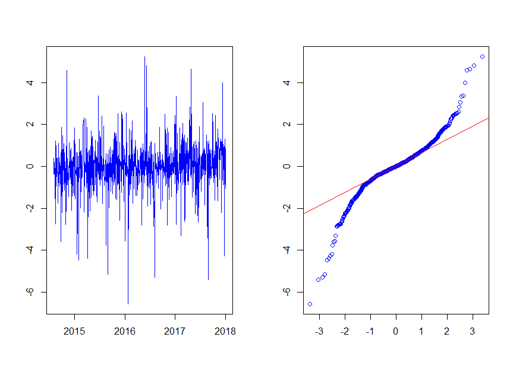

[](http://quantlet.de/)

## [](http://quantlet.de/) **SRMC_crix** [](http://quantlet.de/)

```yaml


Name of Quantlet: SRMC_crix

Published in: SRMC

Description: 'Use a GARCH(1,1) model and a constant mean to standardize the data input, the log returns of CRIX'

Keywords: 'cryptocurrency, GARCH, heavy-tailed, heteroskedasticity, nonstationary, preprocessing, returns, standardization, variance'

Author: Chengxiu Ling

See also: 'SRMC_QQ_ME_crix, SRMC_Estimation_crix'

Submitted: 15/02/2018 

Input: 'SRMC_crix.json'

Output: 'SRMC_crix, the log returns of CRIX as a data.frame with date and 

price'


```



### R Code
```r

#' @usage  Reform the data and save it as CRIX data frame: date, price used for the empirical study
#' @input  SRMC_crix.json is already saved in the working directory (availabe at 'http://crix.hu-berlin.de')
#' @output SRMC_crix.csv, the log returns of CRIX data.frame with date and price information after 


# clear variables and install necessary packages
# set working directory by setwd('C:/Users/...')
# clear variables and install package
rm(list = ls(all = TRUE))

# Uncomment to change your working directory
# setwd()

# Install required packages
library("rjson")
library(fGarch)

# Get the daily log return of crix price 
crix      = fromJSON("SRMC_crix.json")
price.log.return  = diff(log(crix$price))
price.log.return  = na.omit(price.log.return)

#pre-white data with a GARCH model
GARCHvola = garchFit(~garch(1, 1), data = price.log.return)
crixwhite = price.log.return / volatility(GARCHvola)
crixclean = crixwhite - mean(crixwhite)


CRIX = data.frame(date = crix$date[2:(length(price.log.return) + 1)], price = crixclean)

# uncomment to save the results
# write.csv(CRIX, file = "SRMC_crix", row.names = FALSE) 

```

automatically created on 2018-05-28