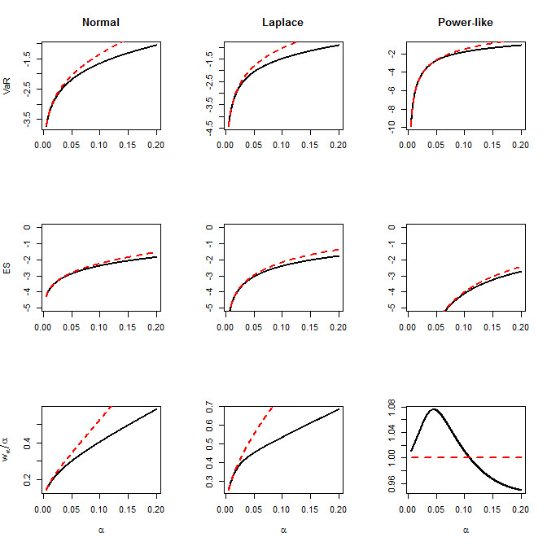

[](http://quantlet.de/)

## [](http://quantlet.de/) **SRMCappr_alpha** [](http://quantlet.de/)

```yaml


Name of Quantlet: SRMCappr_alpha

Published in: unpublished

Description: 'Shows the approximations of VaR, ES and level ratio of expectile vs. quantile with varying alpha and given epsilon'

Keywords: 'normal mixture, Laplace distribution, heavy tail, approximation, Expected shortfall, VaR, expectile, Huber contamination'

Author: Chengxiu Ling

See also: 'SRMCappr_epsilon, SRMCappr_epsilon_alpha'

Submitted: 07/02/2018

Input: 

- alpha: 'the probability level vector for VaR and ES'

- index: 'any subset of (''Normal'', ''Laplace'', ''Power-like''), indicating the choice of contamination model' 

- scale: 'the scale vector of the contamination model indicated by index'

- epsilon: 'the contamination level vector'

Output:  'Approximations and its theoretical values of VaR, ES and level ratio of expectile vs. quantile with varying alpha'

Example: 

- 'SRMCappr_alpha.png, plot of the approximations of VaR, ES and w_alpha / alpha with contamination level epsilon = (0.5, 0.5, 0.5), 

and scale = (1.6, 1.6, 1) for normal, Laplace and Power-like contaminations'


```



### R Code
```r

#' @title Approximations of VaR, ES and level ratio of expectile vs. quantile with varying alpha and given epsilon 
#' @call approximation.VaR.ES.alpha(alpha, index, scale, epsilon) 
#' gives approximation based on contamination model indicated by index
#' @param  alpha, the probability level vector for VaR and ES
#' @param  index, any subset of ('Normal', 'Laplace', 'Power-like'), indicating the choice of H
#' @param  scale, the scale vector of the index function
#' @param  epsilon, the contamination level vector
#' @return The approximations and its theoretical values of VaR, ES and level ratio of expectile vs. quantile
#' @return Plots of approximations of VaR, ES and level ratio to theoretical values with varying alpha 
#' @references see Theorem 2.1

# clear variables and close windows
rm(list = ls(all = TRUE))
graphics.off()

# Standard double-sided exponential distribution with mean zero and variance 1 The
# density l(x) = sqrt(2)*exp(-sqrt(2)*abs(x)), x\in R
plaplace = function(x) {
    Laplace = ifelse(x < 0, 1/2 * exp(sqrt(2) * x), 1 - 1/2 * exp(-sqrt(2) * x))
    return(Laplace)
}

# Standard power tail with \gamma = 1/2, with mean zero and infinitely variance, see
# Example 3.3
ppower = function(x) {
    Power = ifelse(x < 0, 1/2 * (1 + x/sqrt(4 + x^2)), 1 - 1/2 * (1 - x/sqrt(4 + x^2)))
    return(Power)
}


# Give the mixture model with pre-supposed standard normal distribution and contamination model
# being normal, Laplace or Power-like distribution with mean zoeo and scale parameter
mix_cdf = function(x, index, epsilon, scale) {
    if (index == "Normal") {
        mix_cdf = (1 - epsilon) * pnorm(x) + epsilon * pnorm(x/scale)
    } else if (index == "Laplace") {
        mix_cdf = (1 - epsilon) * pnorm(x) + epsilon * plaplace(x/scale)
    } else {
        mix_cdf = (1 - epsilon) * pnorm(x) + epsilon * ppower(x/scale)
    }
    return(mix_cdf)
}

# Calculate the lower partial moment at threshold x of mixture distribution
Lower.partial.moment = function(x, index, epsilon, scale) {
    if (index == "Normal") {
        Lower.partial.moment = (1 - epsilon) * (-dnorm(x)) + epsilon * (-scale * dnorm(x/scale))
    } else if (index == "Laplace") {
        Lower.partial.moment = (1 - epsilon) * (-dnorm(x)) + epsilon * (scale/sqrt(2) * 
            1/2 * (sqrt(2)/scale * x - 1) * exp(sqrt(2)/scale * x))
    } else {
        Lower.partial.moment = (1 - epsilon) * (-dnorm(x)) + epsilon * (-scale * 2/sqrt(4 + 
            (x/scale)^2))
    }
    return(Lower.partial.moment)
}

# Calculate the quantile at alpha level of mixture distribution
mix_VaR = function(alpha, index, epsilon, scale) {
    ff = function(x, alpha, index, epsilon, scale) mix_cdf(x, index, epsilon, scale) - 
        alpha
    VaR = uniroot(ff, c(-20, 10), alpha, index, epsilon, scale)$root  #the accurate alpha-th quantile
    return(VaR)
}


# Calculate the expectile.quantile.transformation level w_alpha such as e_{w_alpha} = q_alpha
expectile.quantile.transformation = function(alpha, index, epsilon, scale) {
    quantile = mix_VaR(alpha, index, epsilon, scale)
    LP = Lower.partial.moment(quantile, index, epsilon, scale)
    expectile.quantile.transformation = (LP - quantile * alpha)/(2 * (LP - quantile * 
        alpha) + quantile)
    return(expectile.quantile.transformation)
}

# Calculate the expected-shortfall of epsilon-contamination model at alpha quantile
mix_ES = function(alpha, index, epsilon, scale) {
    quantile.epsilon = mix_VaR(alpha, index, epsilon, scale)
    mix_ES = alpha^(-1) * Lower.partial.moment(quantile.epsilon, index, epsilon, scale)  #the accurate alpha-th Expected-Shortfall
    return(mix_ES)
}

# Give the theoretical values and its approximations of VaR, ES and level ratio for epsilon-contamination model at alpha level
approximation.VaR.ES.alpha = function(alpha, index, scale, epsilon) {
    size.alpha = length(alpha)
    size.index = length(index)
    Theoretical_VaR.ES.EQT = matrix(rep(1, size.alpha * size.index * 3), nrow = size.alpha)
    Approximation_VaR.ES.EQT = matrix(rep(1, size.alpha * size.index * 3), nrow = size.alpha)
    colnames(Theoretical_VaR.ES.EQT) = paste(c(rep("VaR of", size.index), rep("ES of", 
        size.index), rep("Level ratio of", size.index)), rep(index, 3))
    colnames(Approximation_VaR.ES.EQT) = paste(c(rep("Approximated VaR of", size.index), 
        rep("Approxmated ES of", size.index), rep("Approximated Level ratio of", size.index)), 
        rep(index, 3))
    
    for (i in 1:size.index) {
        # Assign the first size.index columns with theoretical VaR of the mixture model
        Theoretical_VaR.ES.EQT[, i] = sapply(alpha, mix_VaR, index[i], epsilon[i], scale[i])
        
        # Assign the second size.index columns with theoretical ES of the mixture model
        Theoretical_VaR.ES.EQT[, i + size.index] = sapply(alpha, mix_ES, index[i], epsilon[i], 
            scale[i])
        # Assign the third size.index columns with theoretical level ratio of the mixture model
        Theoretical_VaR.ES.EQT[, i + 2 * size.index] = 1/alpha * sapply(alpha, expectile.quantile.transformation, 
            index[i], epsilon[i], scale[i])
        
        # Assign the first size.index columns with approximations of VaR of the mixture model
        Approximation_VaR.ES.EQT[, i] = sapply(alpha/(epsilon[i]), mix_VaR, index[i], 
            1, scale[i])
       
        # Assign the second size.index columns with approximations of ES of the mixture model
        Approximation_VaR.ES.EQT[, i + size.index] = sapply(alpha/(epsilon[i]), mix_ES, 
            index[i], 1, scale[i])
        
        # Assign the third size.index columns with approximations of level ratio of the mixture model
        Approximation_VaR.ES.EQT[, i + 2 * size.index] = 1/(alpha/(epsilon[i])) * sapply(alpha/(epsilon[i]), 
            expectile.quantile.transformation, index[i], 1, scale[i])
    }
    
    par(mfrow = c(3, size.index))
    plot(alpha, Theoretical_VaR.ES.EQT[, 1], col = 1, type = "l", lwd = 2, xlab = "", 
        ylab = "VaR", main = index[1])
    lines(alpha, Approximation_VaR.ES.EQT[, 1], col = 2, lty = 2, lwd = 2)
    for (i in 2:size.index) {
        plot(alpha, Theoretical_VaR.ES.EQT[, i], col = 1, type = "l", lwd = 2, xlab = "", 
            ylab = "", main = index[i])
        lines(alpha, Approximation_VaR.ES.EQT[, i], col = 2, lty = 2, lwd = 2)
    }
    
    plot(alpha, Theoretical_VaR.ES.EQT[, size.index + 1], col = 1, type = "l", lwd = 2, 
        ylim = c(-5, 0), xlab = "", ylab = "ES", main = "")
    lines(alpha, Approximation_VaR.ES.EQT[, size.index + 1], col = 2, lty = 2, lwd = 2)
    for (i in size.index + (2:size.index)) {
        plot(alpha, Theoretical_VaR.ES.EQT[, i], col = 1, type = "l", lwd = 2, ylim = c(-5, 
            0), xlab = "", ylab = "", main = "")
        lines(alpha, Approximation_VaR.ES.EQT[, i], col = 2, lty = 2, lwd = 2)
    }
    
    plot(alpha, Theoretical_VaR.ES.EQT[, 2 * size.index + 1], col = 1, type = "l", lwd = 2, 
        xlab = expression(alpha), ylab = expression(w[alpha]/alpha), main = "")
    lines(alpha, Approximation_VaR.ES.EQT[, 2 * size.index + 1], col = 2, lty = 2, lwd = 2)
    for (i in 2 * size.index + (2:size.index)) {
        plot(alpha, Theoretical_VaR.ES.EQT[, i], col = 1, type = "l", lwd = 2, xlab = expression(alpha), 
            ylab = "", main = "")
        lines(alpha, Approximation_VaR.ES.EQT[, i], col = 2, lty = 2, lwd = 2)
    }
    list(`Theoretical value` = Theoretical_VaR.ES.EQT, `Approximation value` = Approximation_VaR.ES.EQT)
}


# Assign parameter value
alpha   = seq(from = 0.005, to = 0.2, by = 1e-04)
index   = c("Normal", "Laplace", "Power-like")
scale   = c(1.6, 1.6, 1)
epsilon = rep(0.5, 3)

#' @call the program to show efficiency of approximations
approximation.VaR.ES.alpha(alpha, index, scale, epsilon)

 

```

automatically created on 2018-05-28