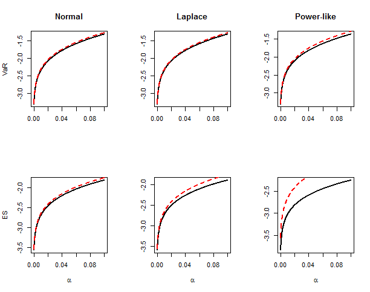
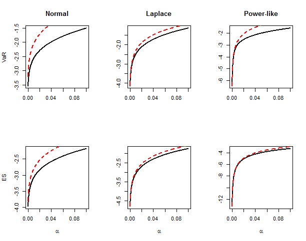

[](http://quantlet.de/)

## [](http://quantlet.de/) **SRMCappr_epsilon_alpha** [](http://quantlet.de/)

```yaml


Name of Quantlet: SRMCappr_epsilon_alpha

Published in: unpublished

Description: 'Shows the approximations of VaR, ES with varying alpha and epsilon, a power function of alpha with exponent tau, 

based on the pre-supposed ideal standard normal model, or the contamination model H'

Keywords: 'normal mixture, Laplace, heavy tail, approximation, Expected shortfall, VaR, Huber contamination'

Author: Chengxiu Ling

See also: 'SRMCappr_alpha,  SRMCappr_epsilon'

Submitted:  07/02/2018

Input: 

- alpha: 'the probability level vector for VaR and ES'

- index: 'any subset of (''Normal'', ''Laplace'', ''Power-like''), indicating the choice of contamination model' 

- scale: 'the scale vector of the contamination model indicated by index'

- tau: 'the power indice alpha to define epsilon, i.e., epsilon = alpha^\tau'

Output:  'Approximations and its theoretical values of VaR, ES of epsilon mixture model with epsilon = alpha^tau'

Example: 

- 1: 'SRMCappr_epsilon_alpha_1.png, approximations of VaR, ES  based on normal model with scale = c(1.1, 1.6, 1)

tau = c(0.5, 1, 1) for normal, Laplace and Power-like contaminations'

- 2: 'SRMCappr_epsilon_alpha_2.png, approximations of VaR, ES  based on contamination model with scale = (1.6, 0.95, 1), tau = (0.5, 0.1, 0.5)

for normal, Laplace and Power-like contaminations'


```





### R Code
```r

#' @title Approximations of VaR and ES with varying alpha and epsilon_alpha
#' @call approximation.VaR.ES.epsilon.alpha_normal(index, scale, tau, alpha) gives 
#' gives approximation based on normal pre-supposed ideal model
#' @call approximation.VaR.ES.epsilon.alpha_index(index, scale, tau, alpha)
#' gives approximation based on the contamination model
#' @param  index = 'Normal', 'Laplace' and 'Power-like', indicating the choice of H
#' @param  scale = the scale parameter of the index function
#' @param  tau   = the indice such that epsilon = alpha^tau
#' @return The approximations and its theoretical values of VaR, ES
#' @references see Theorem 2.3 a) and c)

# clear variables and close windows
rm(list = ls(all = TRUE))
graphics.off()

# Standard double-sided exponential distribution with mean zero and variance 1
plaplace = function(x) {
    laplace = ifelse(x < 0, 1/2 * exp(sqrt(2) * x), 1 - 1/2 * exp(-sqrt(2) * x))
    return(laplace)
}

# Standard power tail distribution with \gamma = 1/2, with mean zero and infinitely
# variance, see Example 3.3
ppower_like = function(x) {
    Power_like = ifelse(x < 0, 1/2 * (1 + x/sqrt(4 + x^2)), 1 - 1/2 * (1 - x/sqrt(4 + 
        x^2)))
    return(Power_like)
}

# Give the mixture model with pre-supposed standard normal distribution and contamination model
# being normal, Laplace or Power-like distribution with mean zoeo and scale parameter
mix_cdf = function(x, index, epsilon, scale) {
    if (index == "Normal") {
        mix_cdf = (1 - epsilon) * pnorm(x) + epsilon * pnorm(x/scale)
    } else if (index == "Laplace") {
        mix_cdf = (1 - epsilon) * pnorm(x) + epsilon * plaplace(x/scale)
    } else {
        mix_cdf = (1 - epsilon) * pnorm(x) + epsilon * ppower_like(x/scale)
    }
    return(mix_cdf)
}

# Calculate the lower partial moment at threshold x of mixture distribution
Lower.partial.moment = function(x, index, epsilon, scale) {
    if (index == "Normal") {
        Lower.partial.moment = (1 - epsilon) * (-dnorm(x)) + epsilon * (-scale * dnorm(x/scale))
    } else if (index == "Laplace") {
        Lower.partial.moment = (1 - epsilon) * (-dnorm(x)) + epsilon * (scale/sqrt(2) * 
            1/2 * (sqrt(2)/scale * x - 1) * exp(sqrt(2)/scale * x))
    } else {
        Lower.partial.moment = (1 - epsilon) * (-dnorm(x)) + epsilon * (-scale * 2/sqrt(4 + 
            (x/scale)^2))
    }
    return(Lower.partial.moment)
}

# Calculate the quantile at alpha level and fix epsilon contamination level
mix_VaR = function(alpha, index, epsilon, scale) {
    ff = function(x, alpha, index, epsilon, scale) mix_cdf(x, index, epsilon, scale) - 
        alpha
    VaR = uniroot(ff, c(-20, 10), alpha, index, epsilon, scale)$root  #the accurate alpha-th quantile
    return(VaR)
}


# Calculate ES at alpha level and fix epsilon contamination level
mix_ES = function(alpha, index, epsilon, scale) {
    quantile.epsilon = mix_VaR(alpha, index, epsilon, scale)
    mix_ES = alpha^(-1) * Lower.partial.moment(quantile.epsilon, index, epsilon, scale)  #the accurate alpha-th Expected-Shortfall
    return(mix_ES)
}


# Calculate the quantile at alpha level with epsilon = alpha^tau
mix_VaR_tau = function(alpha, index, tau, scale) {
    epsilon = alpha^tau
    ff = function(x, alpha, index, epsilon, scale) mix_cdf(x, index, epsilon, scale) - 
        alpha
    VaR = uniroot(ff, c(-20, 10), alpha, index, epsilon, scale)$root  #the accurate alpha-th quantile
    return(VaR)
}

# Calculate ES at alpha level with epsilon = alpha^tau
mix_ES_tau = function(alpha, index, tau, scale) {
    epsilon = alpha^tau
    quantile.epsilon = mix_VaR(alpha, index, epsilon, scale)
    mix_ES = alpha^(-1) * Lower.partial.moment(quantile.epsilon, index, epsilon, scale)  #the accurate alpha-th Expected-Shortfall
    return(mix_ES)
}


#' Gives approximation based on normal distribution, the pre-supposed ideal model
approximation.VaR.ES.epsilon.alpha_normal = function(index, scale, tau, alpha) {
    size.index = length(index)
    size.alpha = length(alpha)
    Theoretical_VaR.ES = matrix(rep(1, size.alpha * size.index * 2), nrow = size.alpha)
    Approximation_VaR.ES = matrix(rep(1, size.alpha * size.index * 2), nrow = size.alpha)
    colnames(Theoretical_VaR.ES) = paste(c(rep("VaR of", size.index), rep("ES of", 
        size.index)), rep(index, 2))
    colnames(Approximation_VaR.ES) = paste(c(rep("Approximated VaR of", size.index), 
        rep("Approxmated ES of", size.index)), rep(index, 2))
    
    for (i in 1:size.index) {
        # Assign the first size.index columns with theoretical VaR of the mixture model
        Theoretical_VaR.ES[, i] = sapply(alpha, mix_VaR_tau, index[i], tau[i], scale[i])
  
        # Assign the second size.index columns with theoretical ES of the mixture model
        Theoretical_VaR.ES[, i + size.index] = sapply(alpha, mix_ES_tau, index[i], 
            tau[i], scale[i])
        
        # Assign the first size.index columns with approximations of VaR of the mixture model
        # based on the pre-supposed standard normal distribution
        Approximation_VaR.ES[, i] = sapply(alpha, mix_VaR, index[i], 0, scale[i])
        
        # Assign the second size.index columns with approximations of ES of the mixture model
        # based on the pre-supposed standard normal distribution
        Approximation_VaR.ES[, i + size.index] = sapply(alpha, mix_ES, index[i], 0, 
            scale[i])
    }
    
    par(mfrow = c(2, size.index))
    plot(alpha, Theoretical_VaR.ES[, 1], col = 1, type = "l", lwd = 2, xlab = "", 
        ylab = "VaR", main = index[1])
    lines(alpha, Approximation_VaR.ES[, 1], col = 2, lty = 2, lwd = 2)
    for (i in 2:size.index) {
        plot(alpha, Theoretical_VaR.ES[, i], col = 1, type = "l", lwd = 2, xlab = "", 
            ylab = "", main = index[i])
        lines(alpha, Approximation_VaR.ES[, i], col = 2, lty = 2, lwd = 2)
    }
    
    plot(alpha, Theoretical_VaR.ES[, size.index + 1], col = 1, type = "l", lwd = 2, 
        xlab = expression(alpha), ylab = "ES", main = "")
    lines(alpha, Approximation_VaR.ES[, size.index + 1], col = 2, lty = 2, lwd = 2)
    for (i in size.index + 2:size.index) {
        plot(alpha, Theoretical_VaR.ES[, i], col = 1, type = "l", lwd = 2, xlab = expression(alpha), 
            ylab = "", main = index[i])
        lines(alpha, Approximation_VaR.ES[, i], col = 2, lty = 2, lwd = 2)
    }
    list(`Theoretical value` = Theoretical_VaR.ES, `Approximation value` = Approximation_VaR.ES)
}

#' Gives approximation based on contamination model at alpha / epsilon
approximation.VaR.ES.epsilon.alpha_index = function(index, scale, tau, alpha) {
    size.index = length(index)
    size.alpha = length(alpha)
    Theoretical_VaR.ES = matrix(rep(1, size.alpha * size.index * 2), nrow = size.alpha)
    Approximation_VaR.ES = matrix(rep(1, size.alpha * size.index * 2), nrow = size.alpha)
    colnames(Theoretical_VaR.ES) = paste(c(rep("VaR of", size.index), rep("ES of", 
        size.index)), rep(index, 2))
    colnames(Approximation_VaR.ES) = paste(c(rep("Approximated VaR of", size.index), 
        rep("Approxmated ES of", size.index)), rep(index, 2))
    
    for (i in 1:size.index) {
        # Assign the first size.index columns with theoretical VaR of the mixture model
        Theoretical_VaR.ES[, i] = sapply(alpha, mix_VaR_tau, index[i], tau[i], scale[i])

        # Assign the second size.index columns with theoretical ES of the mixture model
        Theoretical_VaR.ES[, i + size.index] = sapply(alpha, mix_ES_tau, index[i], 
            tau[i], scale[i])

        
        # Assign the first size.index columns with approximations of VaR of the mixture model
        # based on the contamination model at alpha / epsilon
        Approximation_VaR.ES[, i] = sapply(alpha^(1 - tau[i]), mix_VaR, index[i], 
            1, scale[i])
        
        # Assign the second size.index columns with approximations of ES of the mixture model
        # based on the contamination model at alpha / epsilon
        Approximation_VaR.ES[, i + size.index] = sapply(alpha^(1 - tau[i]), mix_ES, 
            index[i], 1, scale[i])
    }
    
    par(mfrow = c(2, size.index))
    plot(alpha, Theoretical_VaR.ES[, 1], col = 1, type = "l", lwd = 2, xlab = "", 
        ylab = "VaR", main = index[1])
    lines(alpha, Approximation_VaR.ES[, 1], col = 2, lty = 2, lwd = 2)
    for (i in 2:size.index) {
        plot(alpha, Theoretical_VaR.ES[, i], col = 1, type = "l", lwd = 2, xlab = "", 
            ylab = "", main = index[i])
        lines(alpha, Approximation_VaR.ES[, i], col = 2, lty = 2, lwd = 2)
    }
    
    plot(alpha, Theoretical_VaR.ES[, size.index + 1], col = 1, type = "l", lwd = 2, 
        xlab = expression(alpha), ylab = "ES", main = "")
    lines(alpha, Approximation_VaR.ES[, size.index + 1], col = 2, lty = 2, lwd = 2)
    for (i in size.index + 2:size.index) {
        plot(alpha, Theoretical_VaR.ES[, i], col = 1, type = "l", lwd = 2, xlab = expression(alpha), 
            ylab = "", main = index[i])
        lines(alpha, Approximation_VaR.ES[, i], col = 2, lty = 2, lwd = 2)
    }
    list(`Theoretical value` = Theoretical_VaR.ES, `Approximation value` = Approximation_VaR.ES)
}

# Assign values to parameters
index = c("Normal", "Laplace", "Power-like")
scale = c(1.1, 1.6, 1)
tau   = c(0.5, 1, 1)
alpha = seq(from = 5e-04, to = 0.1, by = 1e-04)

# Call the function to give the graph SRMCappr_epsilon_alpha_1.png
approximation.VaR.ES.epsilon.alpha_normal(index, scale, tau, alpha)


# Assign values to parameters
index = c("Normal", "Laplace", "Power-like")
scale = c(1.6, 0.95, 1)
tau   = c(0.5, 0.1, 0.5)
alpha = seq(from = 5e-04, to = 0.1, by = 1e-04)
graphics.off()

# Call the function to give the graph SRMCappr_epsilon_alpha_2.png
approximation.VaR.ES.epsilon.alpha_index(index, scale, tau, alpha) 

```

automatically created on 2018-05-28